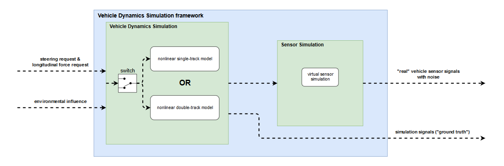

# Vehicle Dynamics Simulation Software of TUM Roborace Team
### Overview
This Vehicle Dynamics Simulation Software has been developed and used for the Roborace Competition. It has been used to develop a Software Stack which achieved 220kph and 95% of the combined lateral and longitudinal acceleration potential of the DevBot. This allowed to drive within 2% of the laptime of an amateur human race driver. The overall research project is a joint effort of the Chair of Automotive Technology and the Chair of Automatic Control.

This software component covers the vehicle dynamics simulation of the real-world racecar and is used extensively for testing the software stack before driving on track. It takes the control module's outputs steering, powertrain and brake commands and delivers sensor signals which are available on the racecar and sent back to the various parts of the software stack (e.g. to the control and state estimation module).
The main functional components are depicted in this architecture diagram:

A video of the performance at the Monteblanco track can be found [here](https://www.youtube.com/watch?v=-vqQBuTQhQw). Current updates on the project status and a list of related scientific publications are available [here](https://www.ftm.mw.tum.de/en/main-research/vehicle-dynamics-and-control-systems/roborace-autonomous-motorsport/). 

### Disclaimer
Autonomous Driving is a highly complex and dangerous task. In case you plan to use this software, it is by all means required that you assess the overall safety concept of your project as a whole. Do not purely rely on any mechanism provided in this software package. See the license for more details.

### People Involved
##### Core Developers
* [Leonhard Hermansdorfer](mailto:hermansdorfer@ftm.mw.tum.de) (double-track model, overall repository responsibility)
* [Alexander Wischnewski](mailto:alexander.wischnewski@tum.de) (single-track model)

##### Acknowledgements
Several students contributed to the success of the project during their Bachelor's, Master's or Project Thesis.
* Dean Petrovski (Sensor modeling)
* Walter Schindler (Implementation of the double-track model)
* Dieter Pfahl (Friction modeling)

### List of software component in this repository
* `interfaces`: Contains interpackage interface definitions. Contact person: [Leonhard Hermansdorfer](mailto:leo.hermansdorfer@tum.de)
* `misc`: Contains several functions to calculate different tasks. Contact person: [Leonhard Hermansdorfer](mailto:leo.hermansdorfer@tum.de)
* `parameters`: Contains all vehicle specific parameters used for vehicle dynamics simulation. Contact person: [Leonhard Hermansdorfer](mailto:leo.hermansdorfer@tum.de)
* `resources`: Contains images used in this readme and further information about the vehicle dynamics models. Contact person: [Leonhard Hermansdorfer](mailto:leo.hermansdorfer@tum.de)
* `scripts`: A collection of useful scripts for operating this module. Contact person: [Leonhard Hermansdorfer](mailto:leo.hermansdorfer@tum.de)
* `sensors`: Sensor models imitating the correct interfaces and noise properties. Contact person: [Leonhard Hermansdorfer](mailto:leo.hermansdorfer@tum.de)
* `vehicledynamics`: All models related to vehicle dynamics, e.g. nonlinear single-track and double-track model and tire models. Contact person: [Leonhard Hermansdorfer](mailto:leo.hermansdorfer@tum.de)

# Installation
This is a brief tutorial how to setup your computer to work with the vehicle dynamics simulation software.

1. Install MATLAB 2018b
2. Create a new folder which will contain the software
3. Create a subfolder `simulation`
4. Checkout the repository in the corresponding subfolders on your local machine
    * `simulation/sim_vehicle_dynamics`
5. Check if you setup everything correctly
    * Go to the `Start Simulation` section below and run a simulation
    * If it runs without errors, your setup is ready to go
    * You can now inspect the results as described below

### Comments on software development infrastructure
Due to the requirement to manage multiple vehicle with the same code, we use Data Dictionaries and Simulink Project extensively. You can find information on [Simulink Project](https://de.mathworks.com/products/simulink/projects.html) and [Data Dictionaries](https://de.mathworks.com/help/simulink/ug/what-is-a-data-dictionary.html) in the Mathworks Simulink Documentation. As long as you do not plan to restructure the repositories or add multiple vehicles, it is not necessary to dive very deep into these topics. There are high level functions available to help you with software configuration (see Working with the Vehicle Dynamics Simulation section).

# Working with the Vehicle Dynamics Simulation

**A detailed overview of both vehicle dynamics models can be found in the [vehicle dynamics](vehicledynamics) folder.**

### Start Simulation
* Open the main project `simulation/sim_vehicle_dynamics/Sim_vehicle_dynamics.prj`
* Open the model `simulation/sim_vehicle_dynamics/vehicledynamics/models/nonlineardtm.slx` in Simulink and run it via the *Run* button to check if everything works correctly
* To run a certain test maneuver, open one of the `.slx` models in `simulation/sim_vehicle_dynamics/vehicledynamics/test` in Simulink and run it via the *Run* button.

### Data Inspection

##### Copy Simulation Output to Workspace
All provided testcases contain a _To Workspace_ simulink block, which writes the simulation output into the Matlab workspace once the simulation has finished.
Within this Matlab _structs_ named `SimRealState` and `SimInformation` you find the bus signals descirbed in the Readme within the folder `simulation/sim_vehicle_dynamics/vehicledynamics/`.
This signals can be visualized by using the standard plot tools provided by Matlab.

To save the simulation output, right-click on one of the _struct_ elements in the Workspace and Choose `Save as...`.

##### Use Scopes or the Data Inspection Tool
To visualize and assess the simulation data Mathworks provides different tools, e.g. scopes or the *Data Inspector*.
For further information consult the Matlab Documentation *View and Analyze Simulation Results*.

If you choose `Enable data logging` on a simulink signal, it will also be written to the Workspace as a _struct_ element and named `logsout`.

# Adapt the Vehicle Dynamics Simulation to your vehicle
In the following, you find a guide how to modify the example vehicle such that it corresponds to your own vehicle.

In general, it is recommended to modify the example vehicle parameters. The only case where it is necessary to add a new vehicle is if you have to maintain multiple vehicle configurations or want to contribute to the upstream development. Please have in mind, that every vehicle has a two character identifier, which is used extensively throughout the project. In the case of this example vehicle it is `pa`. You will find this in front of many file names in this tutorials. All of these files are vehicle specific and may be subject to reconfiguration in a multiple vehicle setup.

### Integration into your own simulation toolchain
To integrate the vehicle dynamics models into your own simulation toolchain, create a referenced submodel containing either the single-track or double-track model. 
Provide the correct model inputs and adjust the model configuration to your own simulation. In addition, adjust the vehicle parameters, as described below, to match your target vehicle.

### Adjust the vehicle parameters
To adapt the software to your vehicle, the vehicle parameters have to be adjusted for simulation.
The simulation's vehicle parameters are located in `simulation/sim_vehicle_dynamics/parameters/*.sldd`. A description of the parameters can be found in the related documentation.

##### Model Configuration:
Simulink requires to specify the Target Hardware in the modelconfig. The project uses a quite complex structure to maintain these modelconfigs. This emerged from the need to support multiple targets with the same code and very different configs. The configs are located in `simulation/sim_vehicle_dynamics/interfaces/datadict/modelconfig.sldd`. The standard config used for the passenger vehicle repository is called `GRT`. Adjust the configuration according to your needs, e.g. Target Hardware and save everything. It is required to reload the project to apply the changes to all models.
