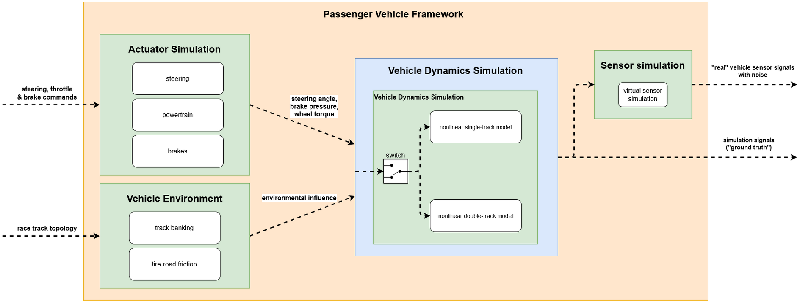

# Vehicle Dynamics Simulation Software of TUM Autonomous Motorsport

### Overview
The following repository covers the vehicle dynamics simulation of a real-world racecar and can be used for testing an autonomous driving software stack before driving on a real track. There are three variants of different complexity available, please see `./vehicle_model/vehicledynamics/Readme.md` for details. As an input, the simulation takes steering, powertrain and brake commands from a control part of the software stack. In addition, the simulation delivers sensor signals which are available on the racecar and sent back to the various parts of the software stack (e.g. to the control and state estimation module).

This simulation has been developed and used for the Roborace Competition. With this simulation we evaluated and tested and autonomous driving software stack which achieved 220kph and 95% of the combined lateral and longitudinal acceleration potential of an autonomous racecar. This allowed to drive within 2% of the laptime of an amateur human race driver. The overall research project is a joint effort of the Chair of Automotive Technology and the Chair of Automatic Control.

The main functional components of the vehicle dynamics simulation are depicted in this architecture diagram:

A video of the performance at the Monteblanco track can be found [here](https://www.youtube.com/watch?v=-vqQBuTQhQw). Current updates on the project status and a list of related scientific publications are available [here](https://www.ftm.mw.tum.de/en/main-research/vehicle-dynamics-and-control-systems/roborace-autonomous-motorsport/).

### Disclaimer
Autonomous Driving is a highly complex and dangerous task. In case you plan to use this software, it is by all means required that you assess the overall safety concept of your project as a whole. Do not purely rely on any mechanism provided in this software package. See the license for more details.

### People Involved

##### Contact person
[Leonhard Hermansdorfer](mailto:leo.hermansdorfer@tum.de)

##### Core Developers
* [Leonhard Hermansdorfer](mailto:leo.hermansdorfer@tum.de) (overall repository responsibility, double-track model)
* [Alexander Wischnewski](mailto:alexander.wischnewski@tum.de) (single-track model)

##### Acknowledgments
Several students contributed to the success of the project during their Bachelor's, Master's or Project Thesis.
* Dean Petrovski (Sensor modeling)
* Walter Schindler (Implementation of the double-track model)
* Dieter Pfahl (Friction modeling)
* Dominik Stärk (Banking & friction modeling, powertrain model)
* Jens Wesker (C++ implementation of the vehicle dynamics models)

### List of software component in this repository
* `helper_funcs_simvehdyn`: Contains some helper functions used in several other functions within this repository.
* `interfaces`: Contains inter-package interface definitions.
* `parameters`: Contains all vehicle specific parameters used for vehicle dynamics simulation.
* `racetracks`: Contains different racetracks where the vehicle can drive on.
* `resources`: Contains images used in this ReadMe and further information about the vehicle dynamics models.
* `scripts`: A collection of useful scripts for operating this module.
* `vehicle_environment`: Contains Simulink models and functions to simulate external, environmental influences on vehicle dynamics, e.g. variable tire-road friction and road banking.
* `vehicle_model`: Contains all models related to vehicle actuation and vehicle dynamics, e.g., powertrain models, nonlinear single-track & double-track model and tire models.

# Installation
This is a brief tutorial how to setup your computer to work with the vehicle dynamics simulation software.

1. Install MATLAB 2018b
2. Clone the repository into an existing folder on your local machine. This repository will be stored under `<YOUR_FOLDER>/sim_vehicle_dynamics/`
3. Check if you setup everything correctly
    * Go to the `Start Simulation` section below and run a simulation
    * If it runs without errors, your setup is ready to go
    * You can now inspect the results as described below

### Comments on software development infrastructure
Due to the requirement to manage multiple vehicles with the same code, we use Data Dictionaries and Simulink Project extensively. You can find information on [Simulink Project](https://de.mathworks.com/products/simulink/projects.html) and [Data Dictionaries](https://de.mathworks.com/help/simulink/ug/what-is-a-data-dictionary.html) in the Mathworks Simulink Documentation. As long as you do not plan to restructure the repositories or add multiple vehicles, it is not necessary to dive very deep into these topics. There are high level functions available to help you with software configuration (see Working with the Software Stack section).

# Working with the Software Stack
A detailed overview of both vehicle dynamics models can be found in the `./vehicle_model/vehicle_dynamics` folder.

### Start Simulation
* Open the main project `/sim_vehicle_dynamics/Sim_vehicle_dynamics.prj`.
* Open the model `./vehicle_model/test/test_PassVeh_acc.slx` in Simulink and run it via the Run button to check if everything works correctly.
* Specific tests for the vehicle dynamics models are located in `./vehicle_model/vehicledynamics/test/check_n*tm`.
* If you want to create your own maneuver, copy and paste one of the test .slx files in the same folder. Modify the model inputs to implement the desired vehicle maneuver.

### Integration into your own simulation toolchain
To integrate the vehicle dynamics models into your own simulation toolchain, create a referenced submodel containing either the single-track or double-track model.
Provide the correct model inputs and parameters and adjust the model configuration to your own simulation.

### Data Inspection

##### Copy Simulation Output to Workspace
All provided testcases contain a _To Workspace_ Simulink block, which writes the simulation output into the Matlab workspace once the simulation has finished.
Within this Matlab _structs_ named `SimRealState` and `SimInformation`(these files will have the same name the _To Workspace_ blocks have) you find the bus signals described in the ReadMe within the folder `./vehicle_model/vehicledynamics/`.
This signals can be visualized by using the standard plot tools provided by Matlab.

In order to get a quick overview of the vehicle behavior, there is a simple script in `./scripts/` called `plot_VehicleMovement.m`. If the Matlab struct called `SimRealState` has been written to your workspace, you can run the visualization script and examine the vehicle behavior.

To save the simulation output, right-click on one of the _struct_ elements in the Workspace and Choose `Save as...`.

##### Use Scopes or the Data Inspection Tool
To visualize and assess the simulation data Mathworks provides different tools, e.g. scopes or the *Data Inspector*.
For further information consult the Matlab Documentation *View and Analyze Simulation Results*.

If you choose `Enable data logging` on a "Simulink signal line", it will also be written to the Workspace as a _struct_ element and named `logsout`.

# Adapt the Vehicle Dynamics Simulation to your vehicle
In the following, you find a guide how to modify the example vehicle such that it corresponds to your own vehicle.

In general, it is recommended to modify the example vehicle parameters. The only case where it is necessary to add a new vehicle is if you have to maintain multiple vehicle configurations or want to contribute to the upstream development. Please have in mind, that every vehicle has a two character identifier, which is used extensively throughout the project. In the case of this example vehicle it is `pa`. You will find this in front of many file names in this tutorials. All of these files are vehicle specific and may be subject to reconfiguration in a multiple vehicle setup.

### Integration into your own simulation toolchain
To integrate the vehicle dynamics models into your own simulation toolchain, create a referenced submodel containing either the single-track or double-track model.
Provide the correct model inputs and adjust the model configuration to your own simulation. In addition, adjust the vehicle parameters, as described below, to match your target vehicle.

### Adjust the vehicle parameters
To adapt the software to your vehicle, the vehicle parameters have to be adjusted.
The simulation's vehicle parameters are located in `./parameters/`. A description of the parameters can be found in the related documentation.

### Model Configuration
Simulink requires to specify the Target Hardware in the modelconfig. The project uses a quite complex structure to maintain these modelconfigs. This emerged from the need to support multiple targets with the same code and very different configs. The configs are located in `./interfaces/datadict/modelconfig.sldd`. The standard config used for the passenger vehicle repository is called `GRT`. Adjust the configuration according to your needs, e.g. Target Hardware and save everything. It is required to reload the project to apply the changes to all models.

### Adjust solver settings
The standard solver setting within the Simulink model is a ode2 solver. For some reasons, it could be necessary to change the settings to a higher order solver (e.g. ode5). When your Simulink model is open, click on `Model Configuration Parameters` (pictogram is a cogwheel).
Then click on `Open referenced configuration...` which is located next to the name of the referenced configuration at the top of the window. The appearing window looks the same as the one before but now allows you to adjust the settings. Go to `Solver` and change the solver settings in the second line to the desired solver.

# Important Notes and Model Restrictions
There are some aspects which have to be kept in mind when using the simulation model.

## Notes
- the standard setting for the solver is a ode2 solver. In some cases, this solver leads to unrealistic vehicle behavior or causes the model to crash. If you encounter this problem, it could be sufficient to change the solver settings (e.g to ode4 or ode5).
- when using the ode2 solver, the model equations sometimes don't converge properly or even lead to unrealistic signal output (e.g. vehicle has come to standstill but x-acceleration is slightly positive). As described above, change settings to a higher order solver.
- especially when approaching the handling limits of the car, a higher solver is recommended. Keep in mind that especially open-loop maneuvers will cause the vehicle to become unstable quite often.

## Model restrictions
- the model does tend to oscillate when driving at very low speeds. This is caused by model equations and time constants within the model. The problem will occur when driving very slowly for a longer time. If you start from standstill to higher speeds, you might encounter some oscillations which disappear when the vehicle keeps accelerating.
