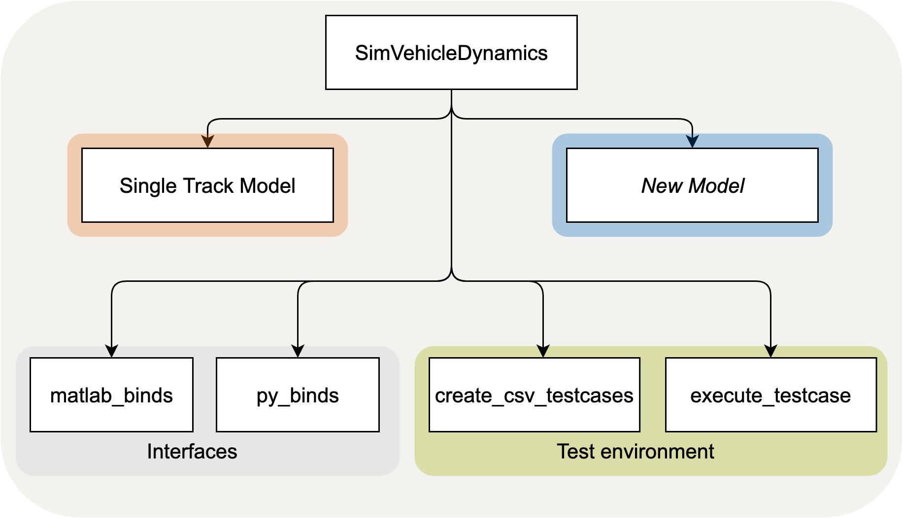
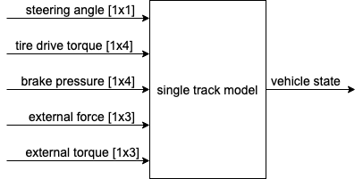

# Vehicle Dynamics Simulation Software of TUM (C++ implementation)

## Overview
Currently, this C++ project is divided into three parts. A single track model was implemented for the vehicle dynamics simulation. This simulation can be executed directly in C. In addition, the simulation can be integrated as an S-function via an interface in Matlab/Simulink. It is also possible to integrate the simulation in Python. In the test environment, data files can be generated to perform basic driving tasks. The tests can be executed in C as well as in Python.
The diagram below gives an overview of the project structure. Special attention was paid to the design of the project so that it can be used in a variety of ways.

## Core Developers
* [Jens Wesker](mailto:jens.wesker@tum.de)
* [Leonhard Hermansdorfer](mailto:leo.hermansdorfer@tum.de)

## Installation
- For the compilation of the project through CMake, see ``README_BUILD_CMAKE.md``
- The integration into Matlab/ Simulink is explained in ``matlab_binds/README.md``
- The creation and installation of a Python wheel is described in ``py_binds/README.md``

## Start Simulation
After installation, the software can be run with the existing test scenarios. All test scenarios are stored in the folder `/test_schenarios`. The test scenarios consist of .csv files that contain the required inputs for the model. The data is loaded during runtime and passed to the model. Special attention must be paid to ensure that the time step between the test data and that of the model match. In addition, the simulation duration must not exceed the duration of the test.

As an example, an execution of the test scenarios is already implemented in the files `/src/main.c` and `/py_binds/main.py`. The execution between the functions in C and Python differ slightly. In the following, only the function calls in Python are showed.

Before executing a test scenario, an object of the class Single Track Model must be created via the command:
- stm = SingleTrackModel.SingleTrackModel("solver")
Valid input arguments for the solver are "euler", "heuns" and "adams". These represent the current solution algorithms that have been implemented.

Moreover, the parameters must be initialized via :
- stm.setParams_stm()

Optionally, the initial state of the vehicle can be defined via the corresponding set functions:
- stm.set_posx_ini(position) initial position in m
- stm.set_psi_ini(psi) initial orientation in rad
- stm.set_vx_veh(vx_mps) initial velocity in m/s
- stm.set_ax_veh(ax_mps2) initial acceleration in m/s^2
- etc.

The behaviour of the test case can be controlled via the following functions:
- stm.set_timestep(double) - set the timestep for the single track model to the timestep of the test_scenario data
- stm.set_logging(int) - activate (1) or deactivate logging of the test results
- stm.set_timecap_testcase(double) - determine the duration of the testcase
- stm.set_lograte_testcase(double) - determine at what interval the vehicle status is logged
- stm.set_testfile_testcase(bytes string) - set the name of the test_scenario. The scenario must be located inside the `/test_scenario` folder
- stm.run_testcase() - execute the test scenario in python

To execute the simulation step by step, the step_simulation() function is called in Python within a loop. The figure below shows the inputs and outputs of the vehicle dynamics model. By default, all values are initialized to zero.

The values for the drive torque/brake pressure can be set individually for each tire using the corresponding set function. The most important functions in Python are:
- stm.set_steeringangle(steering_angle) angle must be provided in radiant
- stm.set_tiretorque_4w_Nm([t_frontleft, t_frontright, t_rearleft, t_rearright]) the torque is given in Nm
- set_brakepressure_4w_Pa([pb_frontleft, pb_frontright, pb_rearleft, pb_rearright]) the brake pressure is given in Pa

Every function that can be used in the SimVehicleDynamics project in Python is defined in the `/py_binds/SingleTrackModel.py` file.

## Adapt the Vehicle Dynamics Simulation to your Vehicle
In order to adjust the physical properties of the simulated vehicle, the vehicle parameters can be varied. The vehicle parameters for the single-track model are stored in the file `/parameters/sim_vehicleparameters.ini`. The parameters are read in during runtime. The functions from the following repository ([inih](https://github.com/benhoyt/inih)) were used for this purpose.

## Visualization
in order to visualize the results of the test cases a Python script was created.
Script `/test_scenarios/compare_real_tests.py` compares different test scenarios and solvers with each other as examples.

## Disclaimer
THIS SOFTWARE IS PROVIDED BY JENS WESKER AND LEONHARD HERMANSDORFER ''AS IS'' AND ANY
EXPRESS OR IMPLIED WARRANTIES, INCLUDING, BUT NOT LIMITED TO, THE IMPLIED
WARRANTIES OF MERCHANTABILITY AND FITNESS FOR A PARTICULAR PURPOSE ARE
DISCLAIMED. IN NO EVENT SHALL JENS WESKER OR LEONHARD HERMANSDORFER BE LIABLE FOR ANY
DIRECT, INDIRECT, INCIDENTAL, SPECIAL, EXEMPLARY, OR CONSEQUENTIAL DAMAGES
(INCLUDING, BUT NOT LIMITED TO, PROCUREMENT OF SUBSTITUTE GOODS OR SERVICES;
LOSS OF USE, DATA, OR PROFITS; OR BUSINESS INTERRUPTION) HOWEVER CAUSED AND
ON ANY THEORY OF LIABILITY, WHETHER IN CONTRACT, STRICT LIABILITY, OR TORT
(INCLUDING NEGLIGENCE OR OTHERWISE) ARISING IN ANY WAY OUT OF THE USE OF THIS
SOFTWARE, EVEN IF ADVISED OF THE POSSIBILITY OF SUCH DAMAGE.
