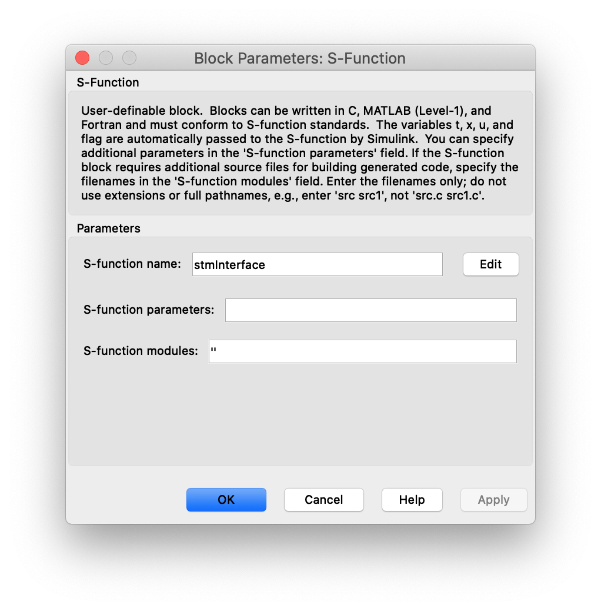

# Worklflow for integrating the vehicle dynamics model inside Matlab/ Simulink

The goal is to make the vehicle dynamics simulation available as an S-function in Matlab/Simulink.
First, the Simulink project in which the model will be integrated must be opened.
Then the folder /matlab_binds must be added to the Matlab path.
In order to use an S-Function, the source code must be compiled in Matlab.
To check whether a compiler is available in Matlab, the following command can be executed in the Matlab Command Window:
```
mex -setup
````
A compiler for the programming language C is required.
To compile the required files, the script `/matlab_binds/compile_sfun.m`   can be executed in the matlab command window.
This creates the file `stmInterface.mex*` in the `/build` folder.
The name of the file extension depends on the operating system being used.
Then you can open a Simulink Model (.slx file) and add an S-Function.
Double-clicking on the S-Function Block opens the dialogue window below.

By adding the "S-function name: stmInterface" and clicking apply, the appearance of the block changes to:


If the number of inputs and outputs of the block does not change, the S-function is not recognized.
The input ports signals are as follows:
- steering angle scalar rad
- tire drive torque [t_frontleft, t_frontright, t_rearleft, t_rearright] Nm
- brake pressure [pb_frontleft, pb_frontright, pb_rearleft, pb_rearright] Pa
- external force [fx, fy, fz]
- external torwue [tx, ty, tz]
- OPTINAL initial values for [vx_veh, vy_veh, dpsi_ini, omega_fl, omega_flr, omega_rl, omega_rr, lambda_perc_fl, lambda_perc_flr, lambda_perc_rl, lambda_perc_rr, aplha_fl, aplha_flr, aplha_rl, aplha_rr]

The output ports signals are as follows:
- [xpos_ini, ypos_ini, psi_ini, vx_veh, vy_veh, dpsi_ini, ax_veh, ay_veh, omega_fl, omega_flr, omega_rl, omega_rr]
- [delta_xpos_ini, delta_ypos_ini, dpsi_ini, ax_ini, ay_ini, ddpsi_ini, domega_fl, domega_flr, domega_rl, domega_rr, dlambda_perc_fl, dlambda_perc_flr, dlambda_perc_rl, dlambda_perc_rr, daplha_fl, daplha_flr, daplha_rl, daplha_rr]

The suffix _ini describes that the value is in the inertial coordinate system.
The suffix _veh describes that the value is in the vehicle-fixed coordinate system.

## References

For more information on how to develop a [S-Function](https://de.mathworks.com/help/simulink/sfg/what-is-an-s-function.html) in Matlab visit the  documentation. The compilation in Matlab using the [mex](https://de.mathworks.com/help/matlab/ref/mex.html?searchHighlight=mex&s_tid=srchtitle) function is also described in the Matlab documentation.
